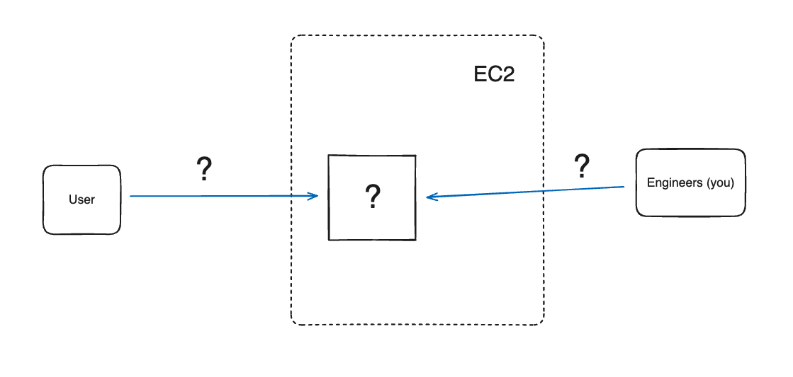

# Deploying an application in the cloud

Learn to

 * Deploy a web application on an instance
 * Explain what is an instance and how we can connect to it
 * Articulate what could go wrong with a manual deployment process and suggest
   solutions to prevent this

## Set up the project

[First, you will need to fork this
project](https://github.com/makersacademy/acebook-node-template-new). Add the
other members of your group as collaborators.

Follow the instructions in the project README to set up the project and get it
running on your local machine.

You'll know you're done when your tests all pass.

## Starting an instance

An "instance" is a virtual server hosted on AWS. It runs "in the cloud" — so we
cannot directly use it. But we can connect to its terminal from our own
computer, using something called SSH.

Using the AWS EC2 console, launch a new instance named `acebook-{YOUR TEAM
NAME}` and:
 * Select the instance type `t2.nano`
 * Make sure to select the OS image named "acebook-node-simple" (in the tab "My
   AMIs").
 * Select the existing security group named `allow-incoming-traffic`.
 * Create a new keypair and save it. Keep it secret, keep it safe. You'll need
   it later.

Once that's done, grab the instance public IP address, then verify you can SSH
into the server by running the command:

```bash
# Create an environment variable for your instance public IP
# (Replace it with yours)
export INSTANCE_IP_ADDRESS="10.10.10.10"

ssh -i path/to/the/keypair ec2-user@$INSTANCE_IP_ADDRESS
```

You should see something like this in your terminal once logged in via SSH:

```bash
   ,     #_
   ~\_  ####_        Amazon Linux 2023
  ~~  \_#####\
  ~~     \###|
  ~~       \#/ ___   https://aws.amazon.com/linux/amazon-linux-2023
   ~~       V~' '->
    ~~~         /
      ~~._.   _/
         _/ _/
       _/m/'
```

Send your keypair file to your coach — they will need it to connect to your instance, if you need any help. Note that you normally you wouldn't send this keypair to anyone!

## Deploying the code

You can deploy a new version of the code with the following process:

```bash
# Create an environment variable for your instance public IP
# (Replace it with yours)
export INSTANCE_IP_ADDRESS="10.10.10.10"

# cd into your project directory
cd acebook-node-template-yourname

# Use rsync to copy all files into the 
# directory /var/acebook on the remote instance
ssh-add path/to/the/keypair
rsync -av -e ssh ./* ec2-user@$INSTANCE_IP_ADDRESS:/var/acebook/

# Use SSH to remotely restart the server 
# on the instance
ssh ec2-user@$INSTANCE_IP_ADDRESS "sudo systemctl restart acebook"

```

## Exercise

Edit the template for the homepage in `views/home/index.hbs` and redeploy the
website using the process above.

Make sure you can access the website using your instance public IP address on
port 3000. You should see the updated version of the homepage in your browser.

## Reflection

In your team, diagram together the current setup of your application on AWS.
Make sure to include:
  * The running instance
  * The HTTP traffic coming from your users
  * The deployment process

Then discuss — what early problems can be caused by this deployment process?

<details>
  <summary>We're not sure where to start with that diagram...</summary>

  That's OK. You can use the one below. Replace the missing labels marked with "?" with the correct labels, and use this same diagram to add more elements as you work on the next challenges.

  
</details>

## Exercise

The engineering team have just finished working on a new version of the code,
adding a few new features. 

This new version of the code is on the branch `new-homepage`. Make sure you
checkout this branch locally, then redeploy the app using the same process than
before.

Ask your coach to verify your work once this is done. Share with them your
diagram as well.

## What's next

Reflect on the learning objectives at the top of this page and discuss whether
the whole team feels comfortable with them.

Then go on to the next section.

[Next Challenge](02_a_first_ci_process.md)

<!-- BEGIN GENERATED SECTION DO NOT EDIT -->

---

**How was this resource?**  
[😫](https://airtable.com/shrUJ3t7KLMqVRFKR?prefill_Repository=makersacademy%2Fdevops-course&prefill_File=acebook-on-aws%2Fprojects%2F01_deploy_on_ec2.md&prefill_Sentiment=😫) [😕](https://airtable.com/shrUJ3t7KLMqVRFKR?prefill_Repository=makersacademy%2Fdevops-course&prefill_File=acebook-on-aws%2Fprojects%2F01_deploy_on_ec2.md&prefill_Sentiment=😕) [😐](https://airtable.com/shrUJ3t7KLMqVRFKR?prefill_Repository=makersacademy%2Fdevops-course&prefill_File=acebook-on-aws%2Fprojects%2F01_deploy_on_ec2.md&prefill_Sentiment=😐) [🙂](https://airtable.com/shrUJ3t7KLMqVRFKR?prefill_Repository=makersacademy%2Fdevops-course&prefill_File=acebook-on-aws%2Fprojects%2F01_deploy_on_ec2.md&prefill_Sentiment=🙂) [😀](https://airtable.com/shrUJ3t7KLMqVRFKR?prefill_Repository=makersacademy%2Fdevops-course&prefill_File=acebook-on-aws%2Fprojects%2F01_deploy_on_ec2.md&prefill_Sentiment=😀)  
Click an emoji to tell us.

<!-- END GENERATED SECTION DO NOT EDIT -->
